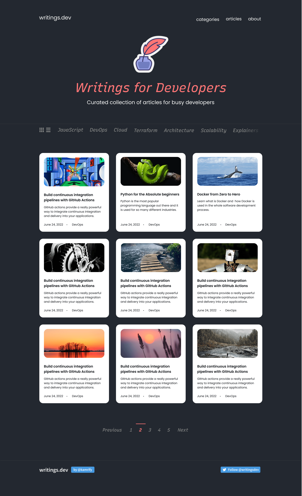

# Writings.dev Clone

This project is my solution to the [pr](https://roadmap.sh/full-stack).

🎨 **Theme:** Frontend Challenge (Dev Blog Page)
ℹ️ **Challenge Source:** [Roadmap.sh](https://roadmap.sh)
💡 **Inspiration/Learning Path Context:** [Full-Stack Roadmap](https://roadmap.sh/full-stack)
💻 **Stack:** HTML, CSS, Tailwind CSS

*Note: The screenshot above references the image file `writings-dot-dev-min.png` located in the root of the project directory.*

